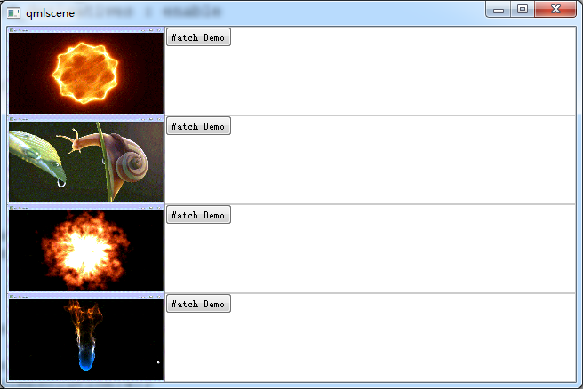
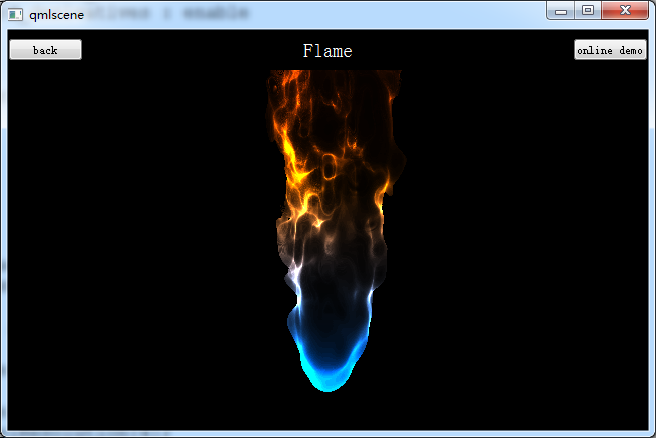

# ShaderToy 学习

ShaderToy demo by QML.





## 一些说明

一些 `QML` 中 `GLSL` 的封装，需要考虑 `GLSL ES` 接口。

```
#ifndef GL_ES

#extension GL_EXT_shader_texture_lod : enable
#extension GL_OES_standard_derivatives : enable

precision highp float;
precision highp int;
precision mediump sampler2D;

#endif

#ifdef GL_ES
precision mediump float;
#endif

uniform lowp float qt_Opacity;
varying highp vec2 qt_TexCoord0;

uniform vec3 iResolution ;

uniform float iGlobalTime;

uniform float     iChannelTime[4];
uniform vec3      iChannelResolution[4];

uniform vec4      iMouse;
uniform sampler2D iChannel0;
uniform sampler2D iChannel1;
uniform sampler2D iChannel2;
uniform sampler2D iChannel3;
uniform vec4      iDate;

uniform float     iSampleRate;
```

在 `ShaderToy` 中一定会使用的 `void mainImage( out vec4 fragColor, in vec2 fragCoord )`。

```
void main(void)
{
    mainImage(gl_FragColor, gl_FragCoord.xy);
}
```

注意，`GLSL` 支持函数重载，但是 `GLSL` 不支持隐式转换，所以参数传递时必须类型匹配。

---

参考

[【ShaderToy】开篇](http://blog.csdn.net/candycat1992/article/details/44039077)

[shadertoy-iOS-v2](https://github.com/beautypi/shadertoy-iOS-v2)
